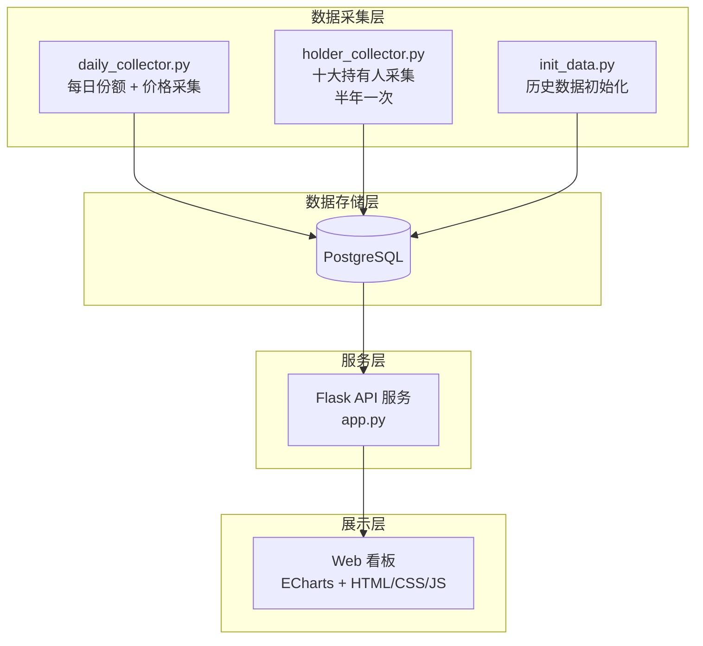

# 🏛️ ETF 国家队量化看板

实时追踪国家队（中央汇金、社保基金等）持仓 ETF 的**份额变化**与**十大持有人**状况，帮助观察机构资金动向。


> ⚠️ **关于数据时效性**
>
> ETF 的**每日份额**数据由上交所每个交易日公布，可做到日频更新。但**十大持有人**数据严格遵循公募基金信息披露规则，仅在**半年报**（报告期截至 6 月 30 日，8 月底前披露）和**年报**（报告期截至 12 月 31 日，次年 3 月底前披露）中公布，**每半年才更新一次**。因此看板中"国家队持仓占比"及"持仓变化"等基于持有人的指标**数据延迟较高**（最长可达 6 个月），仅能反映最近一次定期报告时点的持仓快照，并非实时数据，请注意区分。

## ✨ 功能概览

### 主页看板
- 📈 **国家队 ETF 总份额变化曲线** — 叠加沪深300、中证500、中证1000 价格走势
- 📋 **持仓明细表格** — 日/周/月/季/年份额变化百分比、国家队占比、份额变化、新进标记
- 🔄 支持 1 月 / 3 月 / 1 年时间范围切换
- 🔢 表头可排序，点击行跳转详情

### ETF 详情页
- 📈 **价格 + 份额双轴叠加曲线**
- 👥 **十大持有人对比** — 最新期 vs 上一期，份额变化百分比
- 🏷️ 国家队持有人自动标记

## 🏗️ 技术架构



| 层级 | 技术 |
|---|---|
| 数据采集 | AKShare (份额) + 新浪财经 API (价格、持有人) |
| 数据库 | PostgreSQL |
| 后端 | Flask |
| 前端 | HTML + CSS + JavaScript + ECharts |

## 📁 项目结构

```
etf_tools/
├── schema.sql              # PostgreSQL 建表脚本
├── config.py               # 配置文件 (数据库连接、常量)
├── app.py                  # Flask 后端 API
├── init_data.py            # 历史数据初始化 (首次运行)
├── daily_collector.py      # 每日份额 + 价格采集
├── holder_collector.py     # 十大持有人采集 (半年一次)
├── crawl_sse_etf.py        # 上交所 ETF 列表爬虫
├── find_nt_etfs.py         # 国家队 ETF 筛选爬虫
├── requirements.txt        # Python 依赖
└── static/
    ├── index.html          # 看板主页
    ├── detail.html         # ETF 详情页
    ├── css/style.css       # 暗色主题样式
    └── js/
        ├── main.js         # 主页逻辑
        └── detail.js       # 详情页逻辑
```

## 🚀 快速开始

### 1. 环境准备

- Python 3.10+
- PostgreSQL 14+

```bash
pip install -r requirements.txt
```

### 2. 创建数据库

```bash
createdb -U postgres etf_dashboard
psql -U postgres -d etf_dashboard -f schema.sql
```

### 3. 配置数据库连接

编辑 `config.py` 中的 `DB_CONFIG`，或通过环境变量配置：

```bash
export ETF_DB_HOST=localhost
export ETF_DB_PORT=5432
export ETF_DB_NAME=etf_dashboard
export ETF_DB_USER=postgres
export ETF_DB_PASSWORD=your_password
```

### 4. 获取 ETF 列表 & 国家队筛选

```bash
python crawl_sse_etf.py        # 生成 etf_list.csv
python find_nt_etfs.py         # 生成 national_team_etfs.csv
```

### 5. 初始化历史数据

```bash
python init_data.py
```

> 首次运行约需 15-20 分钟，包括：
> - 回溯约 1 年每日份额数据 (AKShare → 上交所)
> - 获取约 1023 条日K线历史价格 (新浪财经)
> - 获取最新两期十大持有人 (新浪财经)

### 6. 启动看板

```bash
python app.py
```

访问 http://localhost:5000

## 📅 日常维护

```bash
# 每个交易日收盘后运行 (建议 19:00 之后)
python daily_collector.py

# 指定日期采集
python daily_collector.py --date 20260514

# 半年报/年报发布后运行
python holder_collector.py
```

## 📊 数据源说明

| 数据 | 来源 | 更新频率 |
|---|---|---|
| ETF 每日份额 | AKShare → 上交所 | 每个交易日 |
| ETF 历史价格 | 新浪财经 K线 API | 每个交易日 |
| 十大持有人 | 新浪财经基金 API | 半年报 / 年报 |
| ETF 列表 | 上交所云行情 API | 按需 |

> ⚠️ **数据时效性提示**：十大持有人数据仅在半年报（6月30日截止）和年报（12月31日截止）中披露，并非实时数据。

## 🔧 数据库表结构

| 表名 | 用途 |
|---|---|
| `etf_info` | ETF 基本信息 (代码、名称、是否国家队持有) |
| `etf_daily_share` | 每日份额快照 |
| `etf_daily_price` | 每日 OHLCV 价格 |
| `etf_holder` | 十大持有人 (按报告期存储) |
| `nt_etf_list` | 国家队持仓汇总 |

## 📜 License

MIT
